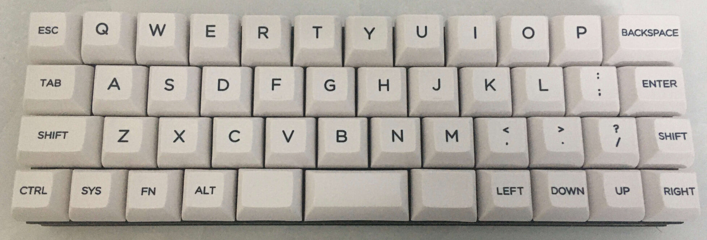
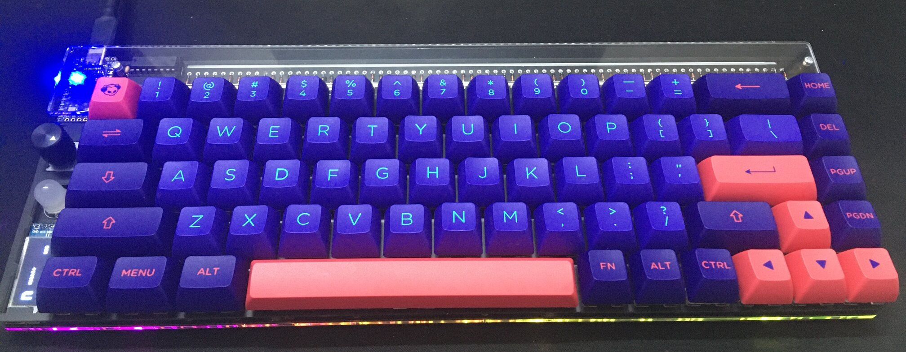
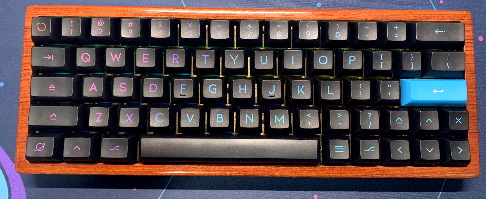
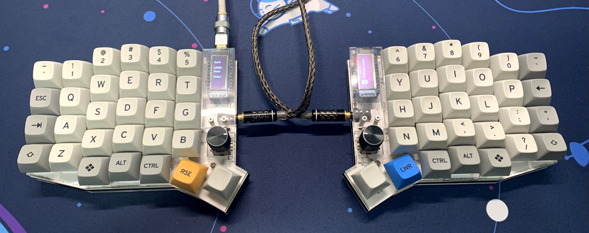
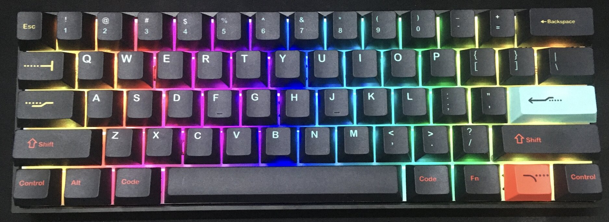
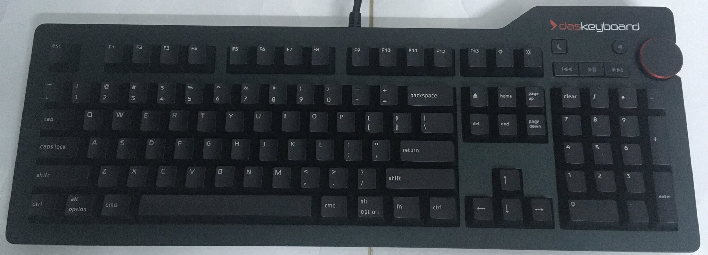
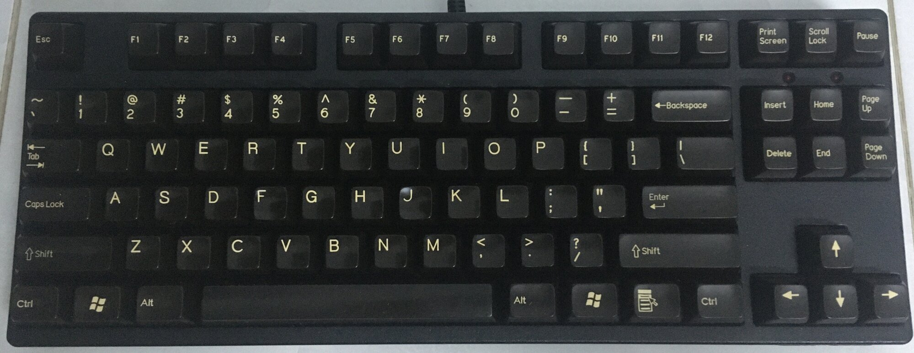

# My Keyboard

## My Keyboard

|               | [UT47.2](https://github.com/ai03-2725/UT47.2) | Nibble 65                                      | GK64XS                                       | Sofle V2    | Anne Pro 2                                       | Das 4                                     | Filco                                       |
| ------------- | --------------------------------------------- | ---------------------------------------------- | -------------------------------------------- | ----------- | ------------------------------------------------ | ----------------------------------------- | ------------------------------------------- |
| Keyboard      |    |  |  |  |  |  |  |
| Switch        | Bombagum                                      | Boba U4                                        | MX Brown                                     | Boba U4T    | Glorious Panda                                   | MX Blue                                   | MX Red                                      |
| Keycap        | KAT                                           | ASA Akko                                       | KAT                                          | MT3         | Cherry                                           | Cherry                                    | SA                                          |
| Number of Key | 47                                            | 72                                             | 64                                           | 60          | 60                                               | 104                                       | 87                                          |

## QMK

- [QMK Firmware](https://github.com/qmk/qmk_firmware)
- [QMK Toolbox](https://github.com/qmk/qmk_toolbox)
- [QMK Configuration](https://github.com/qmk/qmk_configurator)
